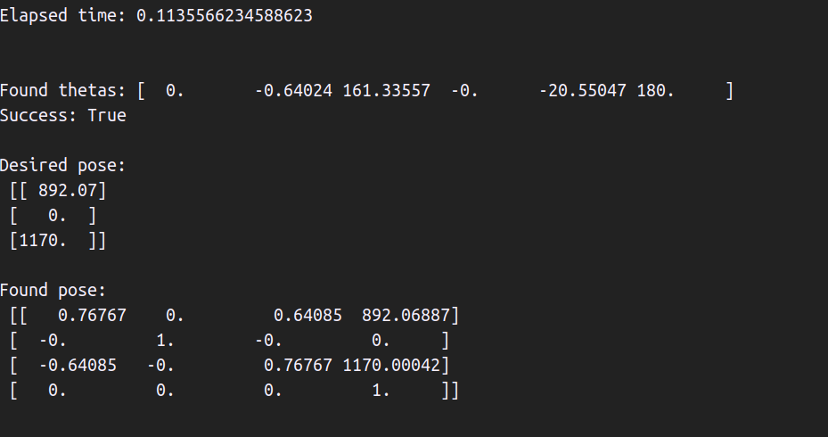

# Robotic Tools

Robotic tools is a library made to make some calculations easier, like robots forward
kinematic's and dynamics. There is also an numerical implementation of inverse velocity kinematic's.

You can use this lib for any robot, since you have the Denavit Hartenberg parameters.

## Forward Kinematics

in order to use the forward kinematics, you gonna need the robot DH parameters. Then
u can create a 'Link' object representation for each link, using the parameters.

```python
import sympy as sp
from lib.link import Link

q1, q2, q3 = sp.symbols('q_1 q_2 q_3')

j0 = Link([q1, 450, 150, sp.pi / 2])
j1 = Link([q2, 0, 590, 0])
j2 = Link([q3, 0, 130, sp.pi / 2])
```

Finally create an instance of the ForwardKinematic class, and pass a list with
all links in the constructor. You can also pass an offset with the angles of home position.

```python
from lib.forward_kinematics import ForwardKinematic

fk = ForwardKinematic([j0, j1, j2], offset=np.array([.0, .0, .0]))
```

The ForwardKinematic class contains the symbolic matrices of transformations, like transformations
from the reference frame to the i-th frame, the end-effector transformation matrix, the jacobian matrix, and other
things.

## Inverse Kinematics

To use the inverse kinematics u need first to have the ForwardKinematic of the robot

### Inverse Kinematics of Position

The inverse kinematics of position uses the Gradient Descent method to find an optimal solution
for the end-effector position.

To use it, as said before, u need the ForwardKinematic. Then, just import the ik_position
method from lib.inverse_kinematics package

```python
import numpy as np
from lib.inverse_kinematics import ik_position

# PX, Py, Pz
desired_position = np.array([.1, .4, .0])

thetas, _, success = ik_position(
  desired_position=desired_position,
  fk=fk,
  initial_guess=np.array([.2, .7, -.1]),
  f_tolerance=1e-5,
  max_iterations=1000,
  lmbd=.1,
  verbose=True
)
```

Output example of the inverse kinematics of position:


### Inverse Kinematics of Position and Orientation

The inverse kinematics of position and orientation uses the jacobian matrix and end-effector velocities
necessary to achive an wanted transformation. This method is also called inverse velocity kinematics. The
end-effector velocities mentioned before are calculated using the methods explained in
Modern Robotics Book (http://hades.mech.northwestern.edu/index.php/Modern_Robotics).

```python
import numpy as np
from lib.inverse_kinematics import ik

# Px, Py, Pz, Rx, Ry, Rz
desired_transformation = np.array([.1, .4, .0, 0, np.pi / 4, 0])

thetas, _, success = ik(
  desired_transformation=desired_transformation,
  fk=fk,
  initial_guess=np.array([.2, .7, -.1]),
  epsilon_wb=1e-5,
  epsilon_vb=1e-5,
  max_iterations=1000,
  lmbd=.1,
  verbose=True,
  only_position=False,
  normalize=False
)
```

Output example for the inverse kinematics of position and orientation


## Forward Dynamics

In order to compute the ForwardDynamics u first need the ForwardKinematic of the robot.
When u instantiate the ForwardDynamic class, it will start to calculate the equations of motion (resulting torque's)
in each link, so it can take a long time if you use the simplify method of sympy library.

The joint variables (thetas) need to be functions of time.

```python
from lib.symbols import t
import sympy as sp

from lib.forward_kinematics import ForwardKinematic
from lib.forward_dynamics import ForwardDynamics
from lib.link import Link

# To use the forward dynamics, the q's need to be functions of time

q1 = sp.Function('q_1')(t)
q2 = sp.Function('q_2')(t)
a1, a2 = sp.symbols('a_1 a_2')

j0 = Link([q1, 0, a1, 0])
j1 = Link([q2, 0, a2, 0])

rr_fk = ForwardKinematic([j0, j1])

fd = ForwardDynamics(rr_fk)
for eq in fd.equations:
  print(' ')
  sp.print_latex(sp.simplify(eq))
  print(' ')
```

Example of forward dynamic equations of an RR planar robot

